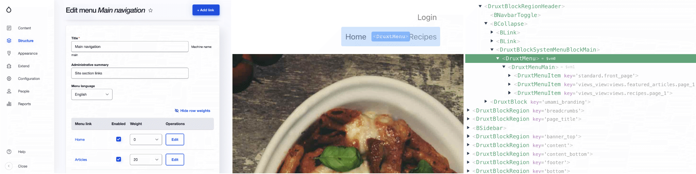

# DruxtMenu

The DruxtMenu module adds a Vue.js Menu component system for your Decoupled Drupal and Nuxt.js application.


## Features

- [Nuxt module](#nuxt-module)
- [DruxtMenu component](#druxtmenu-component)
- [DruxtMenuItems component](#druxtmenuitems-component)
- [Drupal Menu blocks support](#menu-blocks)
- [Druxt Module wrapper theming support](#theming)
- [Druxt Module settings](#module-settings)
- [Auto-generated Nuxt Storybook integration](#storybook)


## Nuxt module

The DruxtMenu module provides Vue.js components, Vuex store and a Nuxt module, among other things.

The Nuxt module installs all required components and dependencies, however most components can be used individually in any Node project.

```js
module.exports = {
  modules: ['druxt-menu'],
  druxt: { baseUrl: 'https://demo-api.druxtjs.org' },
}
```

See [Getting started](/guide/getting-started) and the [API documentation](/api/nuxtModule.html) for more details.


## DruxtMenu component

The `DruxtMenu` component fetches the Menu item JSON:API resources and renders the output using the `DruxtMenuItem` component.

```vue
<DruxtEntity name="main" />
```



It supports a wide range of theming and configuration properties, see the [DruxtMenu component API documentation](../api/components/DruxtMenu.html).


## DruxtMenuItem component.

The `DruxtMenuItem` component is used by the `DruxtMenu` component to render individual menu items as either a child or recursivelty as a parent item.

See the [DruxtMenuItem component API documentation](../api/components/DruxtMenuItem.html).


## Menu blocks

Support for Drupal Menu blocks is provided by the `DruxtBlockSystemMenuBlock` when the [DruxtBlocks](https://blocks.druxtjs.org) module is installed.

See the [DruxtBlockSystemMenuBlock component API documentation](../api/components/blocks/DruxtBlockSystemMenuBlock.html).


## Theming

The DruxtMenu component uses the DruxtModule slot based Wrapper theme system.

This allows for Menu component wrappers, and full control over the output of the menu data.

See the [Wrapper theme system](https://druxtjs.org/guide/#wrapper-theme-system) guide for more information.


## Module settings

### Reducing JSON:API data

The default behaviour of the Menu module is to retrieve all available fields from the JSON:API.

This behaviour is configurable using the modules `query` option, allowing for manually filtered `fields` or automatically filtered fields using the `requiredOnly` option.

The default behaviour can be set via `nuxt.config.js`:
```js
druxt: {
  menu: {
    query: {
      fields: [],
      requiredOnly: true,
    },
  },
}
```

Alternatively, the behaviour can be set directly on a Menu wrapper component:
```js
druxt: {
  query: {
    fields: ['description'. 'options'],
    requiredOnly: false,
  }
}
```


## Storybook

DruxtMenu provides zero-config, auto generated Storybook integration with a live data connnection to your Druxt backend.

See [Gettings started](/guide/getting-started) for more information.
