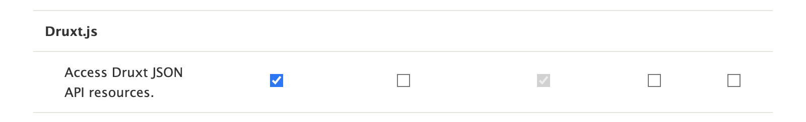

# Getting started

Druxt.js requires a Nuxt.js frontend and a Drupal JSON:API backend:

## Drupal

1. [Install Drupal](https://www.drupal.org/docs/installing-drupal)

2. Download the [Druxt module](https://www.drupal.org/project/druxt):

    ```sh
    composer require drupal/druxt
    ```

3. Install the module:
   

4. Add the "**access druxt resources**" permission to a user/role:
   


## NuxtJS

1. [Install Nuxt](https://nuxtjs.org/guide/installation/)

2. Install the [Druxt module](http://npmjs.com/package/druxt):

    ```sh
    npm i druxt
    ```

3. Add the module and configuration to `nuxt.config.js`:

    ```js
    module.exports = {
      modules: [
        'druxt'
      ],
      druxt: {
        baseUrl: 'https://demo-api.druxtjs.org'
      }
    }
    ```
