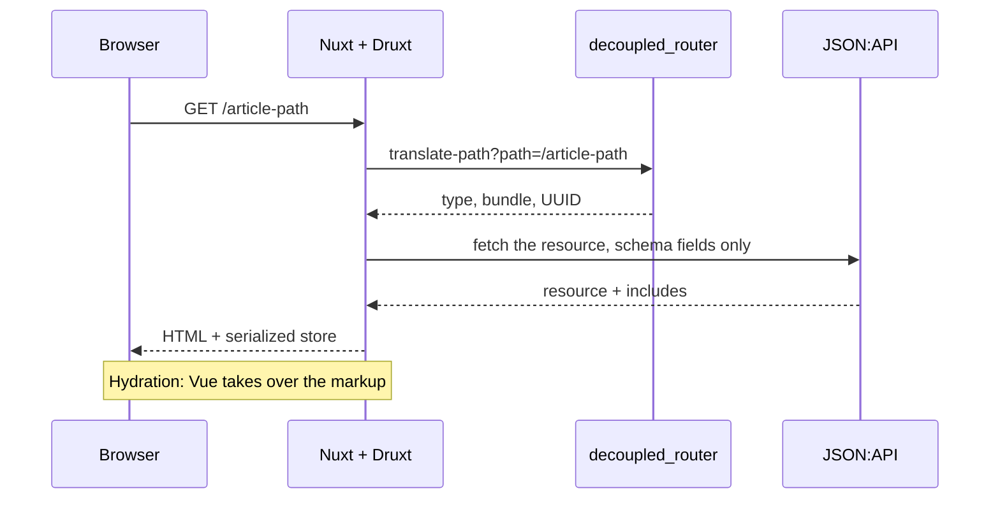

Druxt is a framework for **fully decoupled Drupal and Nuxt.js** sites. In a
traditional (coupled) Drupal site, Drupal both manages and renders content.
In a Druxt site, the two jobs are split:

- **Drupal** models content, configuration and business logic, and exposes
  it as JSON:API.
- **Nuxt** handles the URL, the request lifecycle and the rendering.
- **Druxt** is the contract between them: clients, stores, schemas and
  components that turn JSON:API data into a rendered page.

How much Drupal drives is your choice.
[DruxtSite](/modules/site) renders a whole site from Drupal's block
layout and menus with no frontend layout decisions at all; individual
components (`DruxtEntity`, `DruxtView`, `DruxtMenu`) drop Drupal-driven
pieces into pages and layouts you design yourself; and every component
can be overridden through the [theme layer](/how-to/theming). The
machinery below is the same at any point on that spectrum.

Understanding the split explains most of Druxt's design decisions:

- Why the frontend asks Drupal to translate paths.
- Why display modes drive field rendering.
- Why every component can be themed.

## The request lifecycle

When a browser requests a page from a Druxt site, the work happens in this
order:

1. **Nuxt receives the request** and matches it against its own Vue Router
   routes. In a typical site, a wildcard route hands the path to the
   [router](/explanation/routing) module.
2. **Path translation**: Druxt asks Drupal (via the `decoupled_router`
   module) what entity serves this path. The answer identifies the entity
   type, bundle (Drupal's word for a content type, like `article`), UUID
   and view mode.
3. **Data fetching**: the [DruxtStore](/explanation/druxt-store) checks its
   cache, and asks Drupal's JSON:API for anything missing. [Display-mode
   schemas](/explanation/schemas) can narrow the query so only rendered
   fields travel the wire.
4. **Rendering**: entity, field and block components render the data. Each
   delegates its markup to a [theme component chosen by the suggestion
   system](/explanation/component-resolution).
5. **Response**: Nuxt returns fully server-rendered HTML, then hydrates it
   in the browser: Vue takes over the already-rendered markup and makes it
   interactive without re-fetching the page.

The same five steps, as a picture:

## What lives where

| Layer              | Package(s)                                                      | Responsibility                                                       |
| ------------------ | --------------------------------------------------------------- | -------------------------------------------------------------------- |
| Core client        | `druxt`                                                         | `DruxtClient`: JSON:API communication, authentication, caching hints |
| Core store         | `druxt`                                                         | `DruxtStore`: resource/collection cache shared by all modules        |
| Base component     | `druxt`                                                         | `DruxtModule`: the `druxt()` options contract every module builds on |
| Routing            | `druxt-router`                                                  | Path translation, redirects, metadata                                |
| Schemas            | `druxt-schema`                                                  | Display modes as query-filtering and render configuration            |
| Content            | `druxt-entity`                                                  | Entity and field components                                          |
| Site furniture     | `druxt-blocks`, `druxt-menu`, `druxt-views`, `druxt-breadcrumb` | Blocks, menus, views, breadcrumbs                                    |
| Everything at once | `druxt-site`                                                    | Opinionated bundle: a working site layout out of the box             |

On the Drupal side, the [`druxt`](https://www.drupal.org/project/druxt)
module is the only piece to install (it adds the permissions and path
translators). It depends on `decoupled_router`, `jsonapi_menu_items` and
`jsonapi_views`, so composer and Drupal bring those in with it. See
[Prepare the Drupal backend](/how-to/prepare-the-backend).

## Why this shape

- **JSON:API as the contract** (not custom REST endpoints) keeps the
  frontend compatible with Drupal core's supported web services, including
  its filtering, inclusion and pagination semantics.
- **A shared store** (rather than per-component fetching) means two
  components asking for the same article hit Drupal once, and includes
  (an article's image, the image's file) are stored once no matter which
  query brought them in.
- **Display modes as configuration source** means site builders (not
  frontend developers) decide which fields appear where, using a UI they
  already know.
- **Wrapper components everywhere** keep the frontend from becoming a fork:
  any component's rendering can be replaced per-site without patching the
  framework.

## Trade-offs

The architecture is **opinionated about Drupal**: it assumes JSON:API,
display modes and decoupled routing are available and authoritative. It is
not a general-purpose headless-CMS toolkit: the tight coupling is what
makes the out-of-the-box experience possible.

The current major line targets Nuxt 2 / Vue 2.7; the rendering layer is
designed to be rebuilt (Nuxt 4 / Vue 3) without changing the Drupal-side
contract.

## Where to go next

- [The DruxtStore](/explanation/druxt-store): the data layer in depth.
- [Decoupled routing](/explanation/routing): path translation details.
- [Component resolution](/explanation/component-resolution): the theming
  model.
