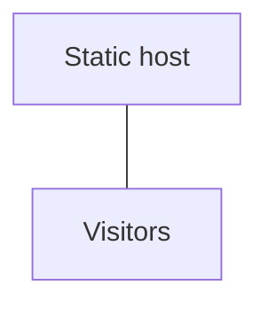
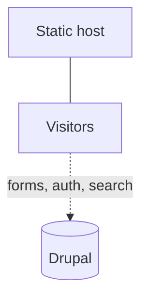
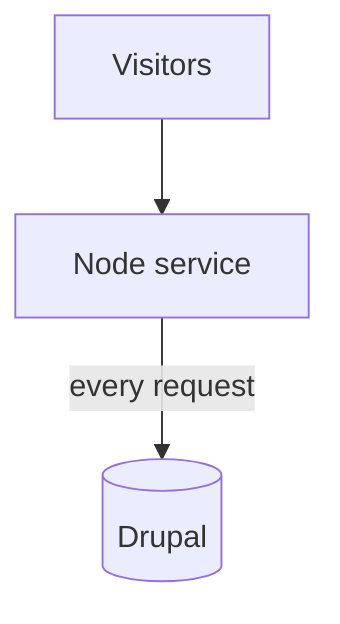

Druxt is a layer on top of Nuxt and Drupal, and it deploys the way Nuxt
deploys: as generated static files, or as a node server. `nuxt generate`
renders every page to files at build time; `nuxt build` compiles an app
that a node server renders per request. The choice decides where you can
host, what it costs, and which features work. [Request
topology](/explanation/request-topology) explains the request mechanics
behind this page.

## The models

|                      | Fully static           | Static + live backend                | Server-rendered |
| -------------------- | ---------------------- | ------------------------------------ | --------------- |
| Build command        | `nuxt generate`        | `nuxt generate`                      | `nuxt build`    |
| Frontend hosting     | Any static host or CDN | Any static host or CDN               | A node server   |
| Drupal in production | Not required           | Required                             | Required        |
| Content updates      | Rebuild                | Rebuild for pages, live for the rest | Live            |
| Forms, auth, search  | No                     | Yes                                  | Yes             |
| API proxy            | No (no server)         | No (no server)                       | Yes             |

**Fully static** generates every page at build time and deploys plain
files, with no backend left running. This is a deliberate build mode, not the
default: an ordinary build still asks Drupal to resolve routes when a
visitor navigates, so going backendless means disabling the router
middleware (`druxt.router.middleware: false` in `nuxt.config.js`) and
cutting out every runtime request. A databaseless backend completes the
shape: Drupal exists only during the build, its content exported to
files with [Tome](https://www.drupal.org/project/tome)'s Tome Sync, as
in the
[quickstart-druxt-site-tome](https://github.com/druxt/quickstart-druxt-site-tome)
starter. The starter does not yet preconfigure the no-runtime-requests
half, so treat that part as an advanced configuration.

**Static + live backend** is the recommended default. Pages are generated
and served from a static host, while the browser talks to the
still-running Drupal for the live parts: authenticated content, form
submissions, search. With no frontend server to proxy through, this
model needs [CORS configured in Drupal](/how-to/configure-cors).

**Server-rendered** runs the built app as a node service: a long-lived
process you supervise, listening on a port behind your web server. Every
request renders live data, the [API proxy](/how-to/proxy) can shield the
backend origin, and server middleware can hold secrets (mail delivery,
search backends). You host and operate that node process alongside PHP.

Production sites also combine models into a hybrid: static files with a
server fallback. One build serves generated pages from a web server with
long cache headers, and a node service behind it catches routes that
were not generated, such as authenticated pages. Nuxt's `target` option
(the build target) can be driven by an environment variable so one
`nuxt.config.js` serves all modes; [Deploy a server-rendered
site](/how-to/deploy-server) shows the working shape.

## Choosing a model

- Content site, editors publish on a schedule: **static + live backend**,
  with scheduled rebuilds.
- Brochure site, content rarely changes: **fully static**, backend off or
  databaseless.
- Logged-in experiences, per-user pages, secrets in server code:
  **server-rendered**, or the hybrid above.

## Serving Druxt from Drupal

A question that comes up regularly: can Druxt run progressively
decoupled, served by Drupal itself?

What works today is the **same-origin layout**: generate the site and let
the web server in front of Drupal serve the files, routing `/jsonapi` and
`/router` to Drupal. One origin, no CORS, and Drupal cookies work
everywhere. The frontend is still a whole application owning the page.

What Druxt does not do today is true progressive decoupling: rendering
individual Druxt components inside Drupal-rendered (Twig) pages. The
components need the running Nuxt application around them (its store and
plugin system), which a Twig page does not have. The tracked feature
request is a custom-elements build: web components a Drupal theme could
attach as a library and place straight into markup. The
[DruxtClient](/how-to/use-the-druxt-client) already runs outside Nuxt,
so the data half of that is ready.

## Where to go next

- [Deploy a static site](/how-to/deploy-static): the generate-and-host
  procedure.
- [Deploy a server-rendered site](/how-to/deploy-server): the node
  service and the hybrid.
- [Environment variables](/how-to/environment-variables): what each
  build needs to know.
- [The deploy-your-site tutorial](/tutorials/deploy-your-site): this
  page's decision, walked end to end from the quickstart.
