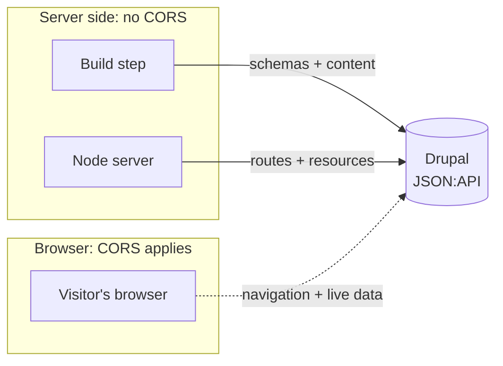

A Druxt site is two applications: a Drupal backend and a Nuxt frontend.
Requests flow between them at three different times, from three different
places. Most "it works locally but not deployed" problems come from not
knowing which of the three is failing.

## The request contexts

| Context          | Who calls Drupal                                         | When                                    | Subject to CORS?                               |
| ---------------- | -------------------------------------------------------- | --------------------------------------- | ---------------------------------------------- |
| Build            | The Node process running `nuxt build` or `nuxt generate` | Once, at build time                     | No                                             |
| Server rendering | The Node server rendering a page                         | On each uncached page request           | No                                             |
| Browser          | The visitor's browser, after hydration                   | On client-side navigation and live data | Yes, when calling Drupal directly cross-origin |

The same table, as a picture:

CORS is a browser security mechanism. Requests made by Node, at build time
or during server rendering, are ordinary server-to-server HTTP and are
never blocked by CORS. Hydration is the moment the browser's JavaScript
takes over the server-rendered page and makes it interactive; everything
the page fetches after that point is a browser request. So a site can
build cleanly, render its first page, and still fail the moment a
visitor clicks a link.

## What happens in each context

**At build time**, Druxt fetches every entity schema from Drupal and writes
them to static JSON files. There are no schema requests after startup; if
the backend is unreachable during a build, the build fails. Display-mode
changes in Drupal need a rebuild or a dev-server restart to appear. See
[The schema system](/explanation/schemas).

**During server rendering**, the DruxtStore fetches routes, entities,
blocks and menus from Drupal and renders the HTML. The store serializes
into the page, so the browser does not refetch what the server already
has. See
[The DruxtStore](/explanation/druxt-store).

**In the browser**, client-side navigation fetches new routes and resources
directly from the JSON:API endpoint, and forms, search and
authenticated content make live requests. CORS applies to these when
they go straight to Drupal on another origin; routed through the proxy,
they stay same-origin.

## CORS and the proxy are alternatives

When the frontend and backend live on different origins, browser requests
to Drupal need one of two things:

| Approach                                           | How it works                                                                                                             | Use it when                                                                          |
| -------------------------------------------------- | ------------------------------------------------------------------------------------------------------------------------ | ------------------------------------------------------------------------------------ |
| [Configure CORS in Drupal](/how-to/configure-cors) | Drupal sends `Access-Control-Allow-Origin` headers, and the browser talks to it directly                                 | You serve a static site, or you want the backend to answer any frontend              |
| [The API proxy](/how-to/proxy)                     | The Nuxt server forwards `/jsonapi` and router requests to Drupal, so the browser only ever talks to the frontend origin | You run a Nuxt server (`nuxt dev` or `nuxt start`) and want single-origin simplicity |

**The proxy is server middleware, and it does not exist in a generated
static site.** `nuxt generate` output is plain files; there is
no Nuxt server to forward requests. A static site whose browser requests
must reach Drupal needs CORS configured in Drupal.

## Hosting layouts

| Layout         | Example                                                               | Notes                                                                                                                                                                                                              |
| -------------- | --------------------------------------------------------------------- | ------------------------------------------------------------------------------------------------------------------------------------------------------------------------------------------------------------------ |
| Separate hosts | `example.com` + `cms.example.io`                                      | The common case. Browser requests are cross-origin: configure CORS or run the proxy.                                                                                                                               |
| Subdomains     | `example.com` + `cms.example.com`                                     | Still cross-origin for CORS purposes: direct browser requests need credentialed CORS with the explicit origin listed. Parent-domain cookie sharing helps authenticated flows without making the hosts same-origin. |
| Same origin    | One domain, a reverse proxy routes `/jsonapi` and `/router` to Drupal | No CORS at all. The routing is defined in your web server's config rather than in Druxt.                                                                                                                           |

Drupal and Nuxt are always two applications with two document roots, even
when one repository holds both. "Hosted together" means a reverse proxy or
platform routes one domain to both; it never means installing Nuxt inside
Drupal.

## baseUrl rules

Every Druxt module (the Nuxt-side packages configured in
`nuxt.config.js`, not the Drupal module) takes a `baseUrl`. The rules
that prevent the most common misconfigurations:

- No trailing slash: `https://cms.example.com`, not
  `https://cms.example.com/`.
- The `endpoint` option (default `/jsonapi`) starts with a slash and does
  not end with one.
- The URL must be reachable **from wherever the request runs**. A Docker
  hostname like `http://drupal` resolves inside the build container but not
  in a visitor's browser; a `localhost` URL means the visitor's own
  machine, not your server. If the two contexts need different URLs, route
  browser traffic through the proxy or a same-origin layout so one URL
  serves both.

## Cookies and sessions

Authenticated flows ride on the same topology. Tokens and cookies issued by
Drupal are scoped to Drupal's origin: a separate-host layout needs the
frontend to send credentials cross-origin (and CORS configured to allow
it), while subdomain and same-origin layouts can share cookies. If
authentication matters to your site, pick the layout first. See
[Deployment models](/explanation/deployment-models) for how these
choices combine.

## Where to go next

- [Deployment models](/explanation/deployment-models): how these choices
  combine into production shapes.
- [Configure CORS in Drupal](/how-to/configure-cors) and
  [Proxy the Drupal backend](/how-to/proxy): the two implementations.
- [Environment variables](/how-to/environment-variables): where
  `baseUrl` comes from per environment.
- [Troubleshoot common issues](/how-to/troubleshooting): the failure
  modes this topology produces.
