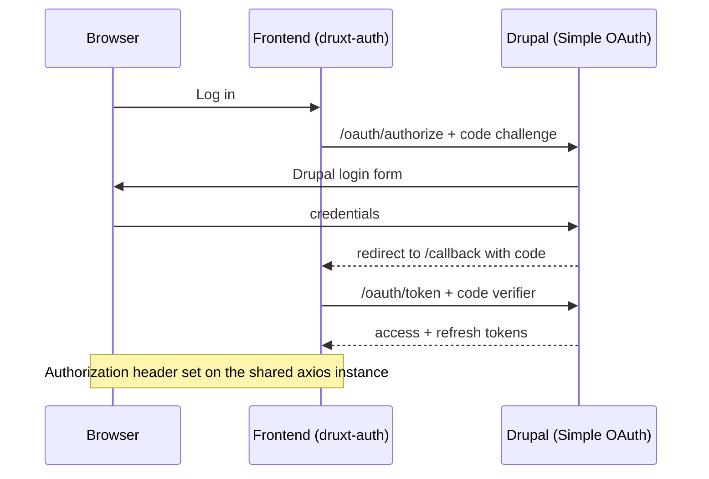

> **Before you start:** the [login flow
> tutorial](/tutorials/authentication) uses the quickstart's ready-made
> OAuth setup. This guide builds that setup from scratch on your own
> backend. Drupal-side commands run in the Drupal project root, with
> [drush](https://www.drush.org) installed
> (`composer require drush/drush`); if the backend runs in a container,
> prefix them with your tool's exec command. New to the Drupal side?
> Start with
> [Drupal for Nuxt developers](/explanation/drupal-for-nuxt-developers).

Druxt authenticates with OAuth 2 Authorization Code + PKCE:
[Simple OAuth](https://www.drupal.org/project/simple_oauth) on the Drupal
side, [druxt-auth](https://github.com/druxt/druxt-auth) (built on
`@nuxtjs/auth-next`) on the Nuxt side. The whole flow:



## Drupal: install and generate keys

Simple OAuth 6.1, the current 6.x line, requires Drupal core 10.3 or
later (6.0 accepted 10.2).

```sh
composer require drupal/simple_oauth:^6.1
drush pm:enable simple_oauth -y
mkdir ../keys
drush simple-oauth:generate-keys ../keys
```

The key pair belongs **outside the web root**; `../keys` here sits next
to Drupal's `web/` directory, not inside it. The directory must exist
before the command runs, and the keys never go in git. If a key file
must live under a served path for platform reasons, commit only a
web-server deny rule for the directory (an `.htaccess` stub on Apache;
an equivalent server rule on nginx). If key generation fails on Windows,
generate under WSL2; native OpenSSL setups there have repeatedly
produced broken keys that surface later as opaque frontend errors.

Set the token lifetimes on the settings form at
`/admin/config/people/simple_oauth`: short access tokens with longer
refresh tokens (minutes and hours respectively) limit the damage of a
leaked token while keeping sessions usable.

## Drupal: create a scope

Simple OAuth 6 refuses any authorization request it cannot resolve a
scope for, and **a fresh site has an empty scope list**, so every login fails
with "Check the `scope` parameter" until one exists. Create one at
`/admin/config/people/simple_oauth/oauth2_scope/dynamic/add`: grant
types `authorization_code` and `refresh_token`, with the `granularity`
field set to **role** and mapped to the role your users hold;
`authenticated` is the usual mapping here.

That same role also needs the **Grant simple_oauth codes** permission
(`grant simple_oauth codes`). Without it the consent screen returns to
itself with "The 'grant simple_oauth codes' permission is required."
and no login completes. The administrator account bypasses permission
checks, so test with a regular user.


## Drupal: create the consumer

A Consumer is Drupal's entity for one registered OAuth client, provided
by the `consumers` module that arrives as a Simple OAuth dependency.
Create one at `/admin/config/services/consumer/add` (an administrator
account is needed for all of these forms):

| Field        | Value                                                       |
| ------------ | ----------------------------------------------------------- |
| Client ID    | A stable id your frontend will use; generate a UUID         |
| Secret       | Empty. A browser app cannot keep a secret; PKCE replaces it |
| Confidential | Off                                                         |
| PKCE         | On                                                          |
| Scopes       | The scope you created, set as the consumer's default        |
| Redirect URI | `https://your-frontend/callback`, one per environment       |


Every frontend origin that logs in needs its redirect URI registered;
the origins people forget are previews and `http://localhost:3000`.
Production setups keep one consumer per environment.

## Nuxt: configure druxt-auth

Options are flat, and the module goes in `modules`, not `buildModules`:
it registers server middleware that `nuxt start` only loads from
`modules`.

```js
export default {
  modules: [['druxt-auth', { clientId: process.env.OAUTH_CLIENT_ID }]],
};
```

No `scope` option is needed. When the app sends none, Drupal applies
the consumer's default scopes, and the consumer table above made your
scope that default. Pass `scope: ['<machine-name>']` only when one
consumer serves several scopes and this app must pick; the value must
equal the scope's machine name in Drupal, or logins fail with the same
"Check the `scope` parameter" error.

The module registers two strategies. `drupal-authorization_code` is the
PKCE flow above and the one to use. `drupal-password` (server-side
password grant) does not work against the backend this page builds:
Simple OAuth 6 removed the password grant (its remaining grants are
authorization code, client credentials and refresh token), so that
strategy only functions against a Simple OAuth 5.x backend. Trigger a
login from any component:

```js
this.$auth.loginWith('drupal-authorization_code');
```

The `/callback` route is handled for you.

## The login page trap

A "Log in" menu link pointing at `/user/login` fails: Decoupled Router
(the Drupal module that [resolves paths](/explanation/routing) for the
frontend) has no resolver for Drupal's user routes, so the request for
that path errors. Either create your own page at `pages/user/login.vue`
that calls `loginWith`, or point the menu link somewhere the frontend
owns. There is no default login page to fall back on.

## Which requests send the token

On login, `@nuxtjs/auth-next` sets the `Authorization` header on the
app's shared axios instance, and Druxt's client uses that same instance
by default, so JSON:API requests for entities, menus and routes carry
the token automatically. Drupal then applies the user's real permissions
to every response. The caveats:

- The header is global to that instance. Requests your app makes to
  third-party APIs through the same `$axios` include the user's token
  too. Give those a separate axios instance.
- Configuring `druxt.axios` in `nuxt.config.js` makes the DruxtClient
  create its own instance, and the automatic header no longer reaches
  it. Either keep the default wiring, or attach the token explicitly
  with `$druxt.addHeaders({ Authorization: this.$auth.strategy.token.get() })`.

The userinfo endpoint is proxied through the frontend only when the
[API proxy](/how-to/proxy) is enabled; without it the browser calls
Drupal's `/oauth/userinfo` cross-origin, which needs
[CORS](/how-to/configure-cors).

## Writes, and the CSRF question

Form submissions through `DruxtEntityForm` are JSON:API writes.
[Enable writes](/how-to/prepare-the-backend#check-the-jsonapi-settings)
(`read_only: 0`) first. With **Bearer token** authentication, no CSRF
token is needed; Drupal's CSRF protection applies to **cookie**
sessions. A 403 naming `X-CSRF-Token` means the request authenticated
by cookie (typically a session shared with the Drupal domain) rather
than by the OAuth header: attach the Bearer token as above, or fetch a
CSRF token from Drupal's `/session/token` and send it in the
`X-CSRF-Token` header alongside cookie auth.

## Keep the session alive

Sessions renew silently out of the box. Simple OAuth issues a refresh
token to this flow when the scope enables the `refresh_token` grant,
and an interceptor on the shared axios instance exchanges it for a
fresh access token on any request that finds the current one expired.
Server rendering joins in: the tokens are stored as cookies, so a cold
reload refreshes during the server render and arrives with fresh
cookies and a restored session.

A custom `druxt.axios` instance bypasses the interceptor (the same
wiring caveat as the Bearer-token section above), and a generated
static site has no server render to restore a cold load. Both fall
outside the automatic path. For those, add a mount-time check
in the default layout: after hydration, when auth storage holds token
state but the session is not logged in, refresh, and when the refresh
fails the tokens are spent, so log out:

```js
// layouts/default.vue
export default {
  mounted() {
    this.$nextTick(() => {
      const hasState = Object.keys(this.$auth.$storage._state).some(
        (key) => !!this.$auth.$storage._state[key],
      );
      if (this.$route.name !== 'callback' && !this.$auth.loggedIn && hasState) {
        this.$auth.refreshTokens().catch(() => this.$auth.logout());
      }
    });
  },
};
```

Skip the callback route (the code exchange is mid-flight there), and
guard against loops if your logout redirects somewhere that mounts this
layout again; a flag in `sessionStorage` set on failure and cleared on
the login page does it.

## Logging out

`this.$auth.logout()` ends the frontend session, and nothing more. Two
things survive it: data fetched while logged in stays in the
[DruxtStore](/explanation/druxt-store) until the page reloads, and the
issued tokens keep working. Measured after a logout with no revocation,
the old access token still answers API requests and the old refresh
token still mints new access tokens for its whole lifetime, because
Simple OAuth has no logout or revocation endpoint of its own
([#2945273](https://www.drupal.org/project/simple_oauth/issues/2945273)
adds one as a patch).

The pattern production Druxt sites use is a dedicated logout page that
revokes, logs out and cleans up, then forces a full page load, which
also empties the store:

```vue
<!-- pages/user/logout.vue -->
<template>
  <p>
    Logging out.
    <NuxtLink to="#" @click.native="logout()">Click here</NuxtLink>
    if you are not redirected.
  </p>
</template>

<script>
export default {
  mounted() {
    this.logout();
  },

  methods: {
    async logout() {
      // Revoke the tokens server-side first. This endpoint comes from
      // the #2945273 patch (or your own route that revokes the user's
      // tokens); proxy it through the frontend so the call is
      // same-origin. Skip this step and the tokens outlive the logout.
      // A failed revocation must not leave the user locally logged in,
      // so the local cleanup below runs regardless.
      try {
        await this.$axios.post('/oauth/logout');
      } catch (e) {
        // Do not log the error object itself: axios keeps the request
        // config, Authorization header included, on rejections.
        console.warn('Token revocation failed; tokens live until expiry.');
      }

      const strategy = this.$auth.strategy.name;
      await this.$auth.logout();

      // auth-next's reset() writes the literal string "false" into these
      // keys rather than removing them (removal happens only on undefined
      // or null), in cookies and localStorage both, so clear both stores.
      [
        `auth._token.${strategy}`,
        `auth._token_expiration.${strategy}`,
        `auth._refresh_token.${strategy}`,
        `auth._refresh_token_expiration.${strategy}`,
        `auth.${strategy}.pkce_state`,
        'auth.strategy',
      ].forEach((name) => {
        document.cookie = `${name}=; Path=/; Max-Age=0`;
        localStorage.removeItem(name);
      });

      // A full page load, not router.push: this is what drops
      // privileged content from the DruxtStore.
      location.href = location.origin;
    },
  },
};
</script>
```

`auth.strategy` reappears on the next page load holding the default
strategy name. That is auth-next seeding itself, for anonymous visitors
too, not leftover session state.

Route the endpoint through the proxy so it shares the frontend origin
(alongside `druxt.proxy.api`, or explicitly):

```js
proxy: {
  '/oauth/logout': process.env.BASE_URL,
},
```

## Known limitations

The limitations documented in the
[authentication tutorial](/tutorials/authentication#known-limitations)
apply to this setup identically: no logout control is included by
default (the [Logging out](#logging-out) section above is the fix), and
the session caveats listed there, the `autoLogout` default, custom
axios instances, and refresh-token lifetimes, apply unchanged.

## Where to go next

- [Deploy with a Nuxt server](/how-to/deploy-server): authenticated
  sites need a runtime; static hosting cannot keep the session.
- [Request topology](/explanation/request-topology#cookies-and-sessions):
  how hosting layout affects cookies and credentialed CORS.
- [druxt-auth README](https://github.com/druxt/druxt-auth): every module
  option.
